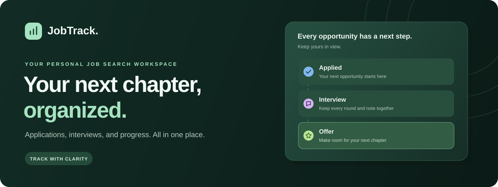

<p align="center">
  
</p>

<p align="center">
  <strong>A clearer view of your job search.</strong><br />
  Track opportunities, manage interviews, and understand your progress in one personal workspace.
</p>

<p align="center">
  <a href="https://jobtracker-eight-brown.vercel.app"><strong>Open JobTrack</strong></a> ·
  <a href="https://jobtracker-eight-brown.vercel.app/demo">Try the demo</a> ·
  <a href="docs/SETUP.md">Setup guide</a> ·
  <a href="https://github.com/tiagoamaro22005058/JobTracker/issues">Report an issue</a>
</p>

<p align="center">
  <a href="https://github.com/tiagoamaro22005058/JobTracker/actions/workflows/ci.yml"></a>
  
  
  
</p>

## Your job search, in one place

JobTrack is a personal job application tracker that brings your roles, companies, notes, and interview stages together. See where every opportunity stands, find the details you need, and keep a clear picture of your search as it evolves.

Use your account to save applications across sessions, or explore the [interactive demo](https://jobtracker-eight-brown.vercel.app/demo) without signing up.

## What you can do

| Capability                   | How it helps                                                                                                          |
| ---------------------------- | --------------------------------------------------------------------------------------------------------------------- |
| **Application workspace**    | Create, view, edit, and delete applications with company, position, location, date, job link, and notes.              |
| **13 pipeline statuses**     | Follow each opportunity through interview rounds and a final outcome. Update statuses directly in the table.          |
| **Search and filters**       | Search companies, roles, and locations; combine status, company, and date filters; sort and browse a paginated table. |
| **Dashboard and statistics** | Review summary cards, current status totals, daily and monthly application activity, and interview and offer rates.   |
| **Personal accounts**        | Register, confirm your email, sign in, and manage your profile. Application access is scoped to its owner.            |
| **Flexible appearance**      | Switch between light, dark, and system themes, with responsive navigation and keyboard-accessible dialogs.            |

### From first interest to final decision

| Stage                  | Available statuses                                                                 |
| ---------------------- | ---------------------------------------------------------------------------------- |
| Getting started        | Interested · Applied · Waiting                                                     |
| Interviewing           | Interview #1 · Interview #2 · Interview #3 · Technical Interview · Final Interview |
| Decisions and outcomes | Offer · Accepted · Rejected · Ghosted · Withdrawn                                  |

Statistics reflect **current application statuses**, rather than a history of every stage. An application that moves to Offer leaves the current interview count. See [metric definitions](docs/SETUP.md#statistics-definitions) for the exact calculations.

## Try it in minutes

1. **Explore:** open the [demo](https://jobtracker-eight-brown.vercel.app/demo) to try sample applications, filters, editing, and analytics.
2. **Create your workspace:** [register](https://jobtracker-eight-brown.vercel.app/register) and confirm your email.
3. **Add your opportunities:** record a role, keep your notes together, and update its status as you progress.
4. **Review your search:** use the dashboard and statistics to see your current pipeline and application activity.

> Demo changes stay in your browser's local storage. They are separate from your account and are never uploaded or imported into your real workspace. New accounts start empty.

## Built with

| Layer                       | Technology                                           |
| --------------------------- | ---------------------------------------------------- |
| Application                 | Next.js 16 App Router · React 19 · TypeScript        |
| Interface                   | Tailwind CSS 4 · Radix Dialog · Lucide · next-themes |
| Charts and validation       | Recharts · Zod                                       |
| Authentication and database | Supabase Auth · PostgreSQL · Row Level Security      |
| Development                 | Node.js 24 · npm · ESLint · Vitest · Prettier        |
| Delivery                    | GitHub Actions for checks · Vercel for hosting       |

The browser communicates with authenticated Next.js API routes. Those routes validate the session and scope application queries to the signed-in user; PostgreSQL ownership policies enforce access at the database layer as well. Supabase manages passwords and sessions. The app uses a public Supabase key and does not require a service-role key.

## Run locally

**Requirements:** Node.js 24, npm, and a Supabase project for the authenticated workspace.

```sh
git clone https://github.com/tiagoamaro22005058/JobTracker.git
cd JobTracker
npm ci
```

Copy `.env.example` to `.env.local` and fill in your project's public values:

```dotenv
NEXT_PUBLIC_SUPABASE_URL=https://your-project.supabase.co
NEXT_PUBLIC_SUPABASE_PUBLISHABLE_KEY=your-publishable-key
```

Then complete the one-time Supabase setup:

1. Run the [initial migration](supabase/migrations/202609080001_applications.sql) in your project's SQL Editor.
2. Enable email/password authentication and configure the [authentication URLs](docs/SETUP.md#configure-authentication), including `http://localhost:3000/auth/callback`.
3. Start the app:

```sh
npm run dev
```

Open [localhost:3000](http://localhost:3000). To explore without configuring Supabase, visit [localhost:3000/demo](http://localhost:3000/demo).

Only publishable or legacy anon keys belong in the browser configuration. Keep secret and service-role keys out of `NEXT_PUBLIC_*` variables. The [full setup guide](docs/SETUP.md) includes database permissions, email confirmation behavior, and troubleshooting.

## Development

| Command             | Purpose                      |
| ------------------- | ---------------------------- |
| `npm run dev`       | Start the development server |
| `npm run lint`      | Check code with ESLint       |
| `npm run typecheck` | Check TypeScript types       |
| `npm test`          | Run the Vitest suite         |
| `npm run build`     | Create a production build    |
| `npm start`         | Serve the production build   |

Tests cover application validation, filters, sorting, statistics, API access boundaries, and authentication callback handling. GitHub Actions runs lint, tests, and a production build. Mocked API tests are complemented by the [manual account-isolation checks](docs/SETUP.md#validation-and-production-build) for a configured Supabase project.

```text
app/                    Pages, protected workspace, and API routes
components/             Navigation, tables, forms, dialogs, and charts
hooks/                  Application state and mutation feedback
lib/                    Validation, statistics, auth, and Supabase clients
services/               Browser-to-API data access
supabase/migrations/    Database schema and ownership policies
tests/                  Model, API, and auth regression tests
docs/                   Setup guide and README assets
```

## Deployment

The live app is hosted on **Vercel**, with automatic production deployments from `main`. To deploy your own instance, import the repository into Vercel, add the public Supabase environment variables, apply the migration, and configure your production Site URL and `/auth/callback` redirect in Supabase.

JobTrack requires a Next.js server for its API routes and cookie-based authentication. GitHub Pages cannot host the current application. See the [Vercel deployment guide](docs/SETUP.md#deploy-to-vercel) for the complete configuration.

## Feedback and contributions

Found a bug or have an idea? [Open an issue](https://github.com/tiagoamaro22005058/JobTracker/issues) with the expected behavior and steps to reproduce. For code changes, keep pull requests focused and run lint, type checks, tests, and a production build before submitting.

---

<p align="center">Built by <a href="https://github.com/tiagoamaro22005058">tiagoamaro22005058</a> · Organize your search. Focus on your next opportunity.</p>
